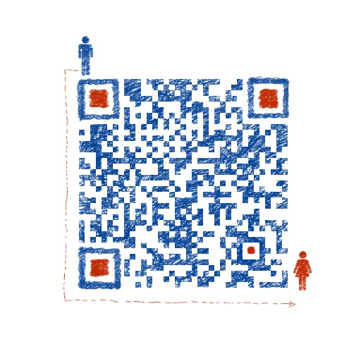

> # [枫上雾棋的日志](https://fengshangwuqi.github.io)

[![gatsby][gatsby-svg]][gatsby-url]
[![Build Status][travis-svg]][travis-url]
[![Netlify Status][netlify-svg]][netlify-url]

[gatsby-svg]: https://img.shields.io/badge/gatsbyjs-V2-blue.svg
[gatsby-url]: https://github.com/gatsbyjs/gatsby
[travis-svg]: https://travis-ci.org/FengShangWuQi/fengshangwuqi.github.io.svg
[travis-url]: https://travis-ci.org/FengShangWuQi/fengshangwuqi.github.io
[netlify-svg]: https://api.netlify.com/api/v1/badges/1c3538cc-a5a4-444c-82bc-65e5c2e5ae02/deploy-status
[netlify-url]: https://app.netlify.com/sites/fengshangwuqi/deploys

- [blog](https://fengshangwuqi.github.io)
- [storybook](https://fengshangwuqi.netlify.com/)
- [taskbook](./tools/taskbook)

我的微信，添加请备注来源

