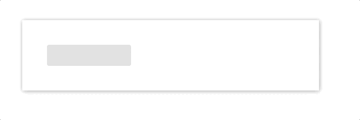
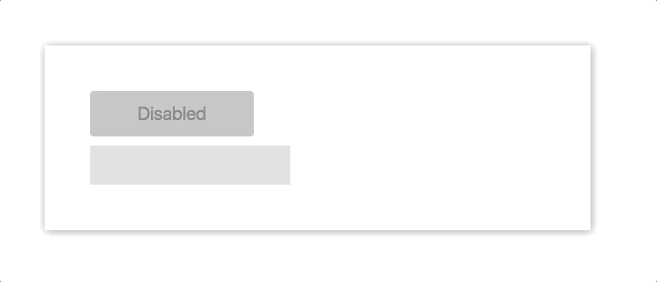
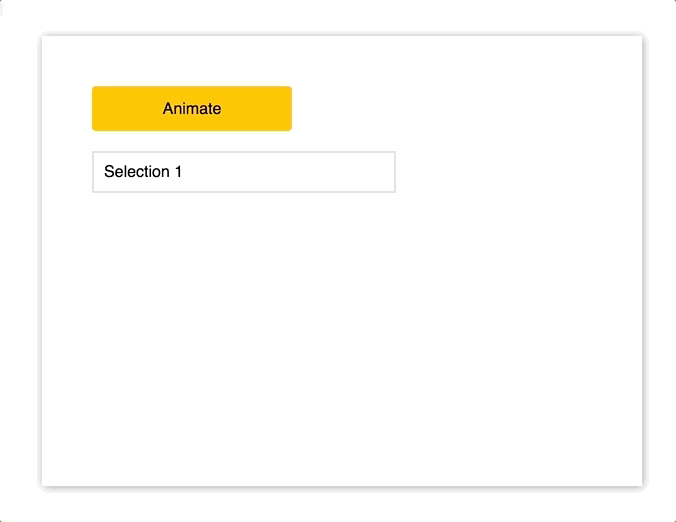
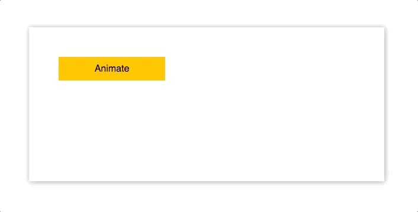
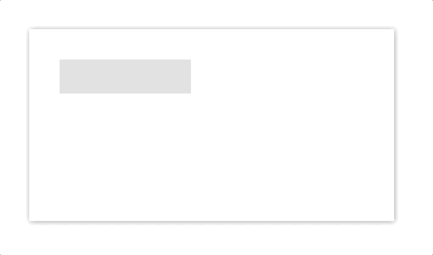

原文：[React Animations in Depth](https://medium.com/react-native-training/react-animations-in-depth-433e2b3f0e8e) by Nader Dabit

> 在 [Tweet](http://t.cn/RQVluB2) 得到很多大佬关于 **React Web 动画** 不错的的回应，于是决定在这里分享给大家。

以下便是本文要分享的创建 **React 动画** 的几种方式：

- CSS animation
- JS Style
- [React Motion](http://t.cn/RLeuFGX)
- [Animated](http://t.cn/R9d015g)
- [Velocity React](http://t.cn/R9dOzS1)

## CSS animation

给元素添加 **class** 是最简单，最常见的书写方式，如果你的 app 正在使用 **CSS**，那么这将是你最愉快的选择。

赞同者：

- 我们只需修改 **opacity** 和 **transform** 这样的属性，就可构建基本的动画；
- 在组件中，我们可以非常容易地通过 **state** 去更新这些值；

反对者：

- 这种方式并 **不跨平台**，在 **React Native** 中就不适用；
- 对于较复杂的动画，这种方式难以控制；

接下来，我们通过一个简单的 demo 来体验一下这种创建方式：当 **input focus** 的时候，我们增加它的宽度。

首先，我们创建两个 **input** 要用到的 **class**：

```css
.input {
  width: 150px;
  padding: 10px;
  font-size: 20px;
  border: none;
  border-radius: 4px;
  background-color: #dddddd;
  transition: width 0.35s linear;
  outline: none;
}

.input-focused {
  width: 240px;
}
```

一个是它原始的样式，一个是它 **focus** 后的样式。

下面，我们就开始书写我们的 **React** 组件。



```jsx
class App extends Component {
  state = {
    focused: false,
  };

  componentDidMount() {
    this._input.addEventListener("focus", this.focus);
    this._input.addEventListener("blur", this.focus);
  }

  focus = () => {
    this.setState(prevState => ({
      focused: !prevState.focused,
    }));
  };

  render() {
    return (
      <div className="App">
        <div className="container">
          <input
            ref={input => (this._input = input)}
            className={["input", this.state.focused && "input-focused"].join(
              " ",
            )}
          />
        </div>
      </div>
    );
  }
}
```

- 我们有一个 **focused** 的 `state`，初始值为 **false**，我们通过更新该值来创建我们的动画；
- 在 `componentDidMount` 时，我们添加两个监听器，一个 **focus**，一个 **blur**，指定的回调函数都是 **focus**；
- `focus` 方法会获取之前 **focused** 的值，并负责切换该值；
- 在 `render` 中，我们通过 **state** 来改变 **input** 的 **classNames**，从而实现我们的动画；

## JS Style

**JavaScript styles** 跟 **CSS** 中的 **class** 类似。

赞同者:

- 跟 **CSS** 动画一样，且它的表现更为清晰，且可以不必依赖 **CSS**；

反对者：

- 跟 **CSS** 动画一样，**不跨平台**，且动画一旦复杂，也难以控制；

在下面的 demo 中，我们将创建一个 **input**，当用户输入时，我们将一个 **button** 从 **disable** 转变为 **enable**。



```jsx
class App extends Component {
  state = {
    disabled: true,
  };

  onChange = e => {
    const length = e.target.value.length;

    if (length > 0) {
      this.setState({ disabled: false });
    } else {
      this.setState({ disabled: true });
    }
  };
  render() {
    const { disabled } = this.state;
    const label = disabled ? "Disabled" : "Submit";

    return (
      <div style={styles.App}>
        <input style={styles.input} onChange={this.onChange} />
        <button
          style={Object.assign(
            {},
            styles.button,
            !this.state.disabled && styles.buttonEnabled,
          )}
          disabled={disabled}>
          {label}
        </button>
      </div>
    );
  }
}

const styles = {
  App: {
    display: "flex",
    justifyContent: "left",
  },
  input: {
    marginRight: 10,
    padding: 10,
    width: 190,
    fontSize: 20,
    border: "none",
    backgroundColor: "#ddd",
    outline: "none",
  },
  button: {
    width: 90,
    height: 43,
    fontSize: 17,
    border: "none",
    borderRadius: 4,
    transition: ".25s all",
    cursor: "pointer",
  },
  buttonEnabled: {
    width: 120,
    backgroundColor: "#ffc107",
  },
};
```

- 我们有一个 **disabled** 的 `state`，初始值为 **true**；
- `onChange` 方法会获取用户的输入，当输入非空时，就切换 **disabled** 的值；
- 根据 **disabled** 的值，确定是否将 `buttonEnabled` 添加到 **button** 中；

## React Motion

**React Motion** 是 [Cheng Lou](https://medium.com/@chenglou) 书写的一个非常不错的开源项目。它的思想是可以对 **Motion** 组件进行简单的样式设置，然后你就可以在回调函数中通过这些值，享受动画带来的乐趣。

对于绝大多数的动画组件，我们往往不希望对动画属性（宽高、颜色等）的变化时间做硬编码处理，**react-motion** 提供的 `spring` 函数就是用来解决这一需求的，它可以逼真地模仿真实的物理效果，也就是我们常见的各类 **缓动效果**。

下面是一个简单的 demo：

```jsx
<Motion style={{ x: spring(this.state.x) }}>
  {({ x }) => <div style={{ transform: `translateX(${x}px)` }} />}
</Motion>
```

这是官方提供的几个 demo，可谓是不看不知道，一看吓一跳。

- [Chat Heads](http://t.cn/R9epBQV)
- [Draggable Balls](http://t.cn/R9eprR8)
- [TodoMVC List Transition](http://t.cn/R9epdOH)
- [Water Ripples](http://t.cn/R9epgoj)
- [Draggable List](http://t.cn/R9epe9u)

赞同者：

- **React Motion** 可以在 **React Web** 中使用，也可以在 **React Native** 中使用，因为它 **跨平台**；
- 其中的 **spring** 概念最开始对我来说很陌生，然而上手之后，发现它真的很神奇，并且，它有很详细的 **API**；

反对者：

- 在某些情况下，他不如纯 **CSS / JS** 动画；
- 虽然它有不错的 **API**，容易上手，但也需要学习成本；

首先使用 **yarn** 或 **npm** 安装：

```bash
$ yarn add react-motion
```

在下面的 demo 中，我们将创建一个 **dropdown** 菜单，当点击按钮时，下拉菜单友好展开。



```jsx
import { Motion, spring } from "react-motion";

class App extends Component {
  state = {
    height: 38,
  };

  animate = () => {
    this.setState(state => ({ height: state.height === 233 ? 38 : 233 }));
  };

  render() {
    return (
      <div className="App">
        <div style={styles.button} onClick={this.animate}>
          Animate
        </div>
        <Motion style={{ height: spring(this.state.height) }}>
          {({ height }) => (
            <div style={Object.assign({}, styles.menu, { height })}>
              <p style={styles.selection}>Selection 1</p>
              <p style={styles.selection}>Selection 2</p>
              <p style={styles.selection}>Selection 3</p>
              <p style={styles.selection}>Selection 4</p>
              <p style={styles.selection}>Selection 5</p>
              <p style={styles.selection}>Selection 6</p>
            </div>
          )}
        </Motion>
      </div>
    );
  }
}

const styles = {
  menu: {
    marginTop: 20,
    width: 300,
    border: "2px solid #ddd",
    overflow: "hidden",
  },
  button: {
    display: "flex",
    width: 200,
    height: 45,
    justifyContent: "center",
    alignItems: "center",
    border: "none",
    borderRadius: 4,
    backgroundColor: "#ffc107",
    cursor: "pointer",
  },
  selection: {
    margin: 0,
    padding: 10,
    borderBottom: "1px solid #ededed",
  },
};
```

- 我们从 **react-motion** 中 **import** `Motion` 和 `spring`；
- 我们有一个 **height** 的 `state`，初始值为 **38**，代表 **menu** 的高度；
- `animate` 方法设置 **menu** 的 **height**，切换 **height** 的值；
- 在 `render` 中，我们使用 **Motion** 组件包装整个 **p** 标签列表，将 **state.height** 的当前值设为组件的 **height**，然后在组件的回调函数中使用该值作为整个下拉的高度；
- 当按钮被点击时，我们通过 `this.animate` 切换下拉的高度；

## Animated

**Animated** 是基于 **React Native** 使用的同一个动画库建立起来的。

它背后的思想是创建 **声明式动画**，通过传递配置对象来控制动画。

赞同者：

- **跨平台**，它在 **React Native** 中已经非常稳定，如果你在 **React Native** 中使用过，那么你将不用再重复学习；
- 其中的 `interpolate` 是一个神奇的插值函数，我们将在下面看到；

反对者：

- 目前不是 **100%** 的稳定，在老的浏览器中的，存在前缀和性能的问题；

首先使用 **yarn** 或 **npm** 安装：

```bash
$ yarn add animated
```

在下面的 demo 中，我们将模拟在提交表单成功后显示的动画 **message**。



```jsx
import Animated from "animated/lib/targets/react-dom";
import Easing from "animated/lib/Easing";

class AnimatedApp extends Component {
  animatedValue = new Animated.Value(0);

  animate = () => {
    this.animatedValue.setValue(0);

    Animated.timing(this.animatedValue, {
      toValue: 1,
      duration: 1000,
      easing: Easing.elastic(1),
    }).start();
  };

  render() {
    const marginLeft = this.animatedValue.interpolate({
      inputRange: [0, 1],
      outputRange: [-120, 0],
    });

    return (
      <div className="App">
        <div style={styles.button} onClick={this.animate}>
          Animate
        </div>
        <Animated.div
          style={Object.assign({}, styles.box, {
            opacity: this.animatedValue,
            marginLeft,
          })}>
          <p>Thanks for your submission!</p>
        </Animated.div>
      </div>
    );
  }
}

const styles = {
  button: {
    display: "flex",
    width: 125,
    height: 50,
    justifyContent: "center",
    alignItems: "center",
    border: "none",
    borderRadius: 4,
    backgroundColor: "#ffc107",
    cursor: "pointer",
  },
  box: {
    display: "inline-block",
    marginTop: 10,
    padding: "0.6rem 2rem",
    fontSize: "0.8rem",
    border: "1px #eee solid",
    borderRadius: 4,
    boxShadow: "0 2px 8px rgba(0,0,0,.2)",
  },
};
```

- 从 **animated** 中 **import** `Animated` 和 `Easing`；
- 用 `new Animated.Value(0)` 创建一个值为 **0** 的类属性 - **animatedValue**；
- 创建 `animate` 方法，处理所有的动画，首先通过 `this.animatedValue.setValue(0)` 初始化动画值，实现的效果就是每次重新执行该动画，然后调用 `Animated.timing`，**animatedValue** 作为第一个参数传递，配置对象作为第二个参数，一个设置最终动画值，一个设置持续时间，一个设置 **缓动效果**。
- 在 `render` 中，我们用 `interpolate` 方法创建 **marginLeft** 对象，包含 **inputRange** 和 **outputRange** 数组，我们使用此对象作为 **UI** 中 **message** 的 **style** 属性；
- 我们使用 `Animated.div` 替代默认的 **div**；
- 我们将 **animatedValue** 和 **marginLeft** 作为 `Animated.div` 的 **style** 属性；

## Velocity React

**Velocity React** 是基于已经存在的 **Velocity** 建立起来的。

赞同者：

- 上手容易，**API** 简单明了，相对其他库更易于掌握；

反对者：

- 有些不得不克服的问题，比如 **componentDidMount** 后动画并没有真正地起作用等；
- **不跨平台**；

下面是一个简单的 demo：

```jsx
<VelocityComponent
  animation={{ opacity: this.state.showSubComponent ? 1 : 0 }}
  duration={500}>
  <MySubComponent />
</VelocityComponent>
```

首先还是先用 **yarn** 或 **npm** 安装：

```bash
$ yarn add velocity-react
```

在下面的 demo 中，我们将创建一个很酷的动画输入。



```jsx
import { VelocityComponent } from "velocity-react";

const VelocityLetter = ({ letter }) => (
  <VelocityComponent
    runOnMount
    animation={{ opacity: 1, marginTop: 0 }}
    duration={500}>
    <p style={styles.letter}>{letter}</p>
  </VelocityComponent>
);

class VelocityApp extends Component {
  state = {
    letters: [],
  };

  onChange = e => {
    const letters = e.target.value.split("");
    const arr = [];

    letters.forEach((l, i) => {
      arr.push(<VelocityLetter letter={l} />);
    });
    this.setState({ letters: arr });
  };

  render() {
    return (
      <div className="App">
        <div className="container">
          <input onChange={this.onChange} style={styles.input} />
          <div style={styles.letters}>{this.state.letters}</div>
        </div>
      </div>
    );
  }
}

const styles = {
  input: {
    marginBottom: 20,
    padding: 8,
    width: 200,
    height: 40,
    fontSize: 22,
    backgroundColor: "#ddd",
    border: "none",
    outline: "none",
  },
  letters: {
    display: "flex",
    height: 140,
  },
  letter: {
    marginTop: 100,
    fontSize: 22,
    whiteSpace: "pre",
    opacity: 0,
  },
};
```

- 从 **velocity-react** 中 **import** `VelocityComponent`；
- 我们要创建一个可重复使用的组件来满足每个 **letter** 的动画；
- 在这个组件中，我们将 **animation** 的 `opacity` 设为 **1**，`marginTop` 设为 **0**，这些值代表着传入子组件的重写值，即当组件被创建时，组件的 `opacity` 会由初始的 **0** 变为 **1**，`marginTop` 会由初始的 **100** 变为 **0**，我们还设置了 **500** ms 的持续时间，最后值得一提的是 `runOnMount` 属性，它的意思是在组件挂载或创建完后执行该动画；
- 其中的 `onChange` 方法会获取用户的每次输入，并创建一个由 **VelocityLetter** 组成的新数组；
- 在 `render` 中，我们就使用该数组在 **UI** 中渲染 **letters**；

## 总结

总的来说，基本的动画，我会选择 **JS style**，复杂的动画，我更偏向 **React Motion**，而对于 **React Native**，我还是坚持使用 **Animated**，一旦 **Animated** 成熟，在 **Web** 中可能也会投入使用，目前，我很享受 **React Motion**。
