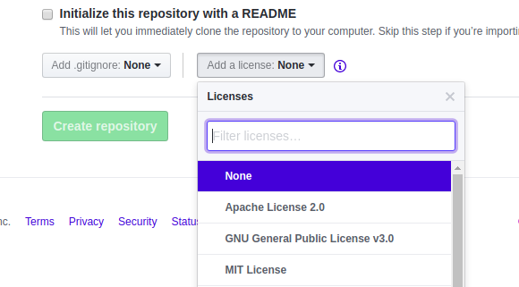
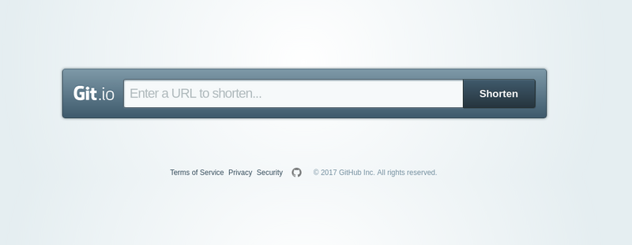
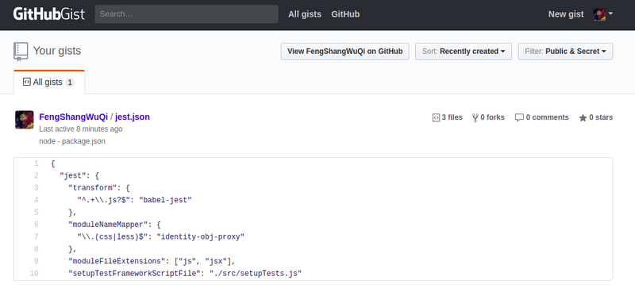
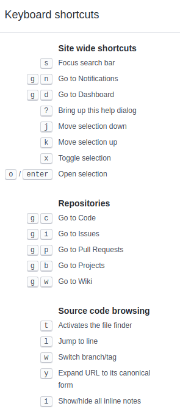

## 基本操作

### 初始化设置

设置用户名和邮箱：

```bash
$ git config --global user.name "用户名"
$ git config --global user.email "邮箱"
```

其中，**--global** 是全局设置，如果想对特定项目使用不同配置，可取消该参数。

**git config** 还可以设置其他选项，因为平时不怎么用，所以详细可以参考  git config --help。

查看配置：

```bash
$ git config --list

# 查看 Git 的某一项配置
$ git config user.name
```

创建 **SSH Key**：

```
$ ssh-keygen -t rsa -C "邮箱"
```

然后会在用户主目录下，发现 **.ssh** 目录，其中包含 **id_rsa** 和 **id_rsa.pub** 两个文件。

**id_rsa.pub** 是 SSH Key 公钥，将其添加到 github 的 SSH keys 中，就可以将本地仓库推送到远程仓库了。

### 创建本地仓库，进行基本源代码管理

```bash
# 初始化仓库
$ git init

将源代码提交到暂存区
$ git add .

# 提交暂存区的源代码
$ git commit -m "本次提交说明"

# 查看当前状态
$ git status
$ git status -sb  // 查看 branch 和 short status

# 查看提交历史
$ git log --pretty=oneline -5
```

### 将本地代码同步至远程仓库

```bash
# 克隆
$ git clone 仓库地址

# 查看远程主机地址
$ git remote -v

# 分支
$ git branch 分支名    // 创建
$ git checkout 分支名  // 切换

# 合并
$ git merge --no-ff 分支名

# 拉取更新
$ git fetch 主机名 分支名	// 不合并
$ git pull 主机名 分支名	// 合并

# 推送
$ git push 主机名 分支名

# 打标签
$ git tag -a 版本号 -m "版本说明"
```

## 进阶操作

### 忽略 SSL 证书错误

通过 **HTTPS** 访问 Git 远程仓库时，如果服务器的 **SSL 证书** 未经过第三方机构签署，那么 Git 就会阻止这一操作。

```bash
$ env GIT_SSL_NO_VERIFY=true git clone 仓库地址
$ cd 仓库名称
$ git config http.sslVerify "false"
```

使用 **env** 命令保证了忽略证书错误只应用于此次克隆。

### 储藏

当有未提交的修改，执行切换分支或拉取更新需要仓库状态保持 **clean** 的一些操作时，可以使用 **git stash** 将目前的修改临时储藏起来。

```bash
# 储藏
$ git stash

# 查看储藏
$ git stash list

# 应用最近储藏并删除
$ git stash pop

# 应用指定储藏不删除
$ git stash apply [储藏名]

# 移除储藏
$ git stash drop 储藏名
```

### 撤消操作

对于 **工作区** 和 **暂存区** 的修改，我们不能保证上次操作是完美的，git 就是这么强大，提供了很多反悔的操作。

```bash
# 丢弃暂存区的文件，放回工作区
$ git reset HEAD 文件

# 丢弃工作区的修改
$ git checkout -- 文件

- 修改后没添加到暂存区，则撤销到 git commit 时的状态
- 修改后添加到暂存区，则撤销到 git add 时的状态

# 覆盖上次提交
$ git commit --amend [-m "本次提交说明"]
```

### 版本回退
```bash
# 回退到之前的某次提交
$ git reset --hard commit_id

- HEAD 指向当前版本
- git log 可以查看提交历史，以便确定要回退到哪个版本
- git reflog 可以查看命令历史，以便确定要回到未来的哪个版本

# 撤销一个已经提交
$ git revert commit_id

- 并没有从项目历史中移除这个 commit, 而是生成一个新的 commit
```

### 分支

Git 有很多优点，其中方便的分之就是很显著的一条，创建仓库的时候，**master** 是默认的分支，一般，我们会创建其他的分支在上面进行开发，完后再将它们合并到主分支上来。

```bash
# 查看所有分支
$ git branch -a

# 创建[并切换]开发分支
$ git branch [-b] dev

# 切换回主分支
$ git checkout master

# 查看合并/没合并到当前分支的分支列表
$ git branch --merged/--no-merged

# 删掉临时分支
$ git branch -d fix

# 将开发分支推送到远程仓库
$ git push origin dev

# 重命名分支
$ git branch -m dev develop

# 删除远程分支
- $ git push origin --delete 分支名
- $ git push origin :分支名
```

### 标签

软件要发布一个新的版本的时候，我们通常给它打个 tag。

```bash
# 打标签
$ git tag [-a] 标签名 [-m 附注信息 某次提交的id]

# 推送标签到远程仓库
$ git push origin 标签名
$ git push origin --tags	// 推送所有标签

# 删除本地标签
$ git tag -d 标签名

# 删除远程标签
$ git push origin --delete 标签名
$ git push origin :refs/tags/标签名
```

### 提交
```bash
# 花式查看提交
$ git log --pretty=oneline  // 只显示一行
$ git log --abbrev-commit   // 只显示 SHA-1 的前几个字符
$ git log --graph           // 显示 ASCII 图形表示的分支合并历史
$ git log --relative-date   // 使用较短的相对时间显示
$ git log --name-only       // 仅在提交信息后显示已修改的文件清单
$ git log -n 			          // 显示最近的 n 条提交
$ git log --author=fengshangwuqi  // 仅显示指定作者相关的提交
$ git log --grep                  // 仅显示含指定关键字的提交
```

没有任何改动的提交：

```bash
git commit -m "a no chnage commit" --allow-empty
```

主要用于一下情形：

- 标记新的工作或一个新功能的开始；
- 记录对项目的跟代码无关的改动；
- 跟使用你仓库的其他人交流；
- 作为仓库的第一次提交，因为第一次提交后不能被 rebase；

### git pull 与 git pull --rebase 的区别

```bash
$ git pull = git fetch + git merge
$ git pull --rebase = git fetch + git rebase
```

### git merge 与 git rebase 的区别

**提交历史不同**：

- merge 会生成一个新的 commit 节点，提交历史忠实地记录了实际发生过什么；
- rebase 不会产生额外的 commit 节点，提交历史反映了项目过程中发生了什么；

**冲突处理策略不同**：

- merge 遇见冲突后会直接停止，等待手动解决冲突并重新提交后，才能再次 merge；
- rebase 遇见冲突后会暂停当前操作，开发者可以选择手动解决冲突，然后 git rebase **--continue** 继续，或 **--skip** 跳过，或 **--abort** 停止；

推荐 git merge 结合 **--no-ff** 一起使用

- git merge 默认是 **fast forward**（快速合并），适用于分支 B 从分支 A 从 checkout 出来后，分支 A 没有 commit
- 如果分支 B 被 checkout 出来后，分支 A 也有修改，那么就没法快速前进合并，会额外建立一个 merge commit，对分支 A 和分支 B 做一个合并操作，即 --no-ff，它的好处是保持了分支的结构

## 其他

### 忽略特殊文件

对于操作系统自动生成的文件，编译生成的中间文件，以及带有敏感信息的配置文件等，我们不想追踪，也不想放进我们的远程仓库中，这时，我们创建一个 **.gitignore** 文件来忽略上述文件，下面是一个前端工程忽略的文件参考。

```
# Logs
logs
*.log

# Runtime data
pids
*.pid
*.seed
*.DS_Store

# testing
coverage

# Dependency directory
node_modules

# Bower
bower_components/
dist

# WebStorm文件
*.idea/

# vscode文件
.vscode/

# Emacs
.tern-port
.#*
*#
*~

# vim
.agignore

# 敏感信息
default.yml
```

### Commit message 指南

好的 Commit message 可以提供更多的历史信息，方便快速浏览和查找，还可以直接生成 **Change log**，一般至少包含 **type** 和 **subject**，type 是 commit 的类别，subject 是 commit 的简短描述。

**type**：

- **feat**：添加新功能
- **fix**：修补缺陷
- **docs**：修改文档
- **style**：修改格式
- **refactor**：重构
- **perf**：优化
- **test**：增加测试
- **chore**：构建过程或辅助工具的变动
- **revert**：回滚到上一个版本

除此之外，有兴趣的同学还可以添加 [gitmoji](https://gitmoji.carloscuesta.me/) 和 [validate-commit-msg](https://github.com/conventional-changelog-archived-repos/validate-commit-msg) 等更多内容。

[使用 Commit 信息关闭 Issue](https://help.github.com/articles/closing-issues-using-keywords/)

如果某个提交修复了一个 Issue，当提交到某个分支时，提交信息里可以使用 **fix/fixes/fixed**, **close/closes/closed** 或者 **resolve/resolves/resolved** 等关键词，后面再跟上 **Issue** 号，这样就会关闭这个 Issue。

```bash
$ git commit -m "fix: ..., fix #1, #2"
```

这将会关闭 Issue #1 和 #2，并且在 Issue 讨论列表里关联引用这次提交。

如果想链接其他仓库的 Issue，则使用 **{user}/{repo}#ISSUE_NUMBER**。

### 快速添加许可证文件

在创建一个仓库时，Github 会为你提供一个预置的软件许可证列表。



如果此时没有选择，后来可以通过 web 界面 **create new file**，输入 **LICENSE**，点击右侧的 **choose a license template** 来添加。


### 一些不错的 github 插件

- [Octotree](https://chrome.google.com/webstore/detail/octotree/bkhaagjahfmjljalopjnoealnfndnagc?hl=zh-CN)：提供项目目录
- [GitHub Plus](https://chrome.google.com/webstore/detail/github-plus/anlikcnbgdeidpacdbdljnabclhahhmd?hl=zh-CN)：提供每个文件的大小和下载链接
- [GitHub Hovercard](https://chrome.google.com/webstore/detail/github-hovercard/mmoahbbnojgkclgceahhakhnccimnplk?hl=zh-CN)：悬停在用户头像或仓库地址上时，通过悬浮框提供更多信息
- [Sourcegraph for GitHub](https://chrome.google.com/webstore/detail/sourcegraph-for-github/dgjhfomjieaadpoljlnidmbgkdffpack?hl=zh-CN)：提供 IDE 上常用的功能操作
- [Awesome Autocomplete for GitHub](https://chrome.google.com/webstore/detail/awesome-autocomplete-for/djkfdjpoelphhdclfjhnffmnlnoknfnd?hl=zh-CN)：提供更强大的智能搜索
- [Isometric Contributions](https://chrome.google.com/webstore/detail/isometric-contributions/mjoedlfflcchnleknnceiplgaeoegien?hl=zh-CN)：更友好地展示提交记录

### Git.io

[Git.io](https://git.io/) 是 Github 的 **短网址** 服务。



你可以通过 **Curl** 命令以普通 **HTTP** 协议使用它：

```bash
$ curl -i https://git.io -F "url=https://github.com/..."
HTTP/1.1 201 Created
Location: https://git.io/abc123

$ curl -i https://git.io/abc123
HTTP/1.1 302 Found
Location: https://github.com/...
```

### Gists

[Gists](https://gist.github.com/) 方便我们管理代码片段，不必使用功能齐全的仓库。



**Gist** 可以非常方便地得到便于嵌入到其他网站的 [HTML 代码](https://gist.github.com/FengShangWuQi/f8a3add492f55fca8bb07987438f6615.pibb)。

而且，**Gists** 可以像任何标准仓库一样被克隆，你可以像 Github 仓库一样去修改和更新 Gists，只不过，Gists 不支持目录，所有文件都添加在仓库的根目录下。

### 使用快捷键

github 仓库页面提供了一些 **快捷键** 方便大家快速导航，按 **?** 可以查看当前页面支持的快捷键列表。



### 使用表情符

我们在 **Pull Requests**, **Issues**, **commit**, **Markdown** 文件中可以加我们喜欢的表情，使用方法如下：

```bash
:name_of_emoji:
```

更多表情，可参考 [emoji-cheat-sheet](https://www.webpagefx.com/tools/emoji-cheat-sheet/)。

其中，可能常用的表情有：

- :tada:
- :sparkles:
- :bug:
- :white_check_mark:
- :wrench:
- :ok_hand:
- :construction_worker:
- :whale:
- :clap: