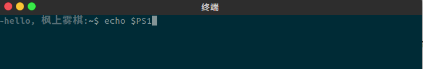
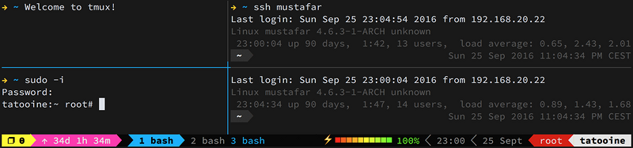

## 准备

- 下载 [Ubuntu Kylin](http://www.ubuntu.org.cn/download/ubuntu-kylin)；
- 使用 [UltraISO](https://cn.ultraiso.net/) 制作 U 盘启动盘；

## 入门

### 目录

- **/home**：用户的主目录
- **/boot**：启动目录，启动相关文件
- **/sbin**：超级用户才能使用的目录
- **/root**：超级用户的主目录
- **/proc**：系统内存的映射
- **/dev**：设备文件保存目录
- **/etc**：配置文件保存目录
- **/lib**：系统库保存目录
- **/usr**：系统软件资源目录
- **/var**：经常变化目录，经常放日志文件
- **/tmp**：临时目录

### 终端

```bash
$ ctrl + alt + t    // 新窗口打开终端
$ ctrl + shift + t  // 新标签页打开终端
```

### 获取 root 权限

```bash
$ sudo passwd root      // 激活账号，设置密码
$ sudo passwd -l root   // 再次禁用 root 帐号
```

### 安装

```bash
$ sudo apt-get install package    // 安装包
$ sudo dpkg -i package_file.deb   // 安装 .deb 文件
```

### 删除

```bash
$ sudo apt-get remove package           // 删除包
$ sudo apt-get remove --purge package   // 删除包和配置文件
$ sudo dpkg -r package_name             // 卸载 .deb 文件
$ sudo dpkg -P package                  // 删除包和配置文件
```

### 更新

```bash
$ sudo apt-get update   // 更新源
$ sudo apt-get upgrade  // 更新已安装的包
```

###  清理

```bash
$ sudo apt-get autoclean  // 清理已经卸载的包
$ sudo apt-get clean      // 清理所有的安装包
$ sudo apt-get autoremove // 清理因依赖而安装但现在不再需要的包
```

## 可能遇到的一些问题

### 开机启动项没有 windows

```bash
$ sudo update-grub
```

###  更改 hosts

```bash
$ sudo gedit /etc/hosts
```

### 安装搜狗输入法

```
下载 -> 系统设置 -> 语言支持 -> 键盘输入法系统 => fcitx
```

###  解决端口冲突

```bash
$ lsof -i:8000      // 查看 8000 端口
$ kill 对应的 pid    // 停止使用这个端口的程序
```

### 设置环境变量

对所有用户生效：

- /etc/profile：为系统的每个用户设置环境信息
- /etc/bashrc：每次新打开一个终端 shell，该文件被读取

对单个用户生效：

- /.bash_profile：当用户登录时该文件仅执行一次
- /.bashrc：当登录以及每次打开新的 shell 时，该文件被读取

使用 **source /etc/environment** 可以使变量设置在当前窗口立即生效，需 **注销/重启** 之后，才能对每个新终端窗口都生效。

### 设置 JAVA 环境变量

```bash
# 更改配置文件
$ sudo gedit /etc/profile

# set java environment
export JAVA_HOME=/home/feng/download/jdk1.8.0_131
export JRE_HOME=$JAVA_HOME/jre
export CLASSPATH=.:$CLASSPATH:$JAVA_HOME/lib:$JRE_HOME/lib
export PATH=$PATH:$JAVA_HOME/bin:$JRE_HOME/bin
```

[Java SE Development Kit 8 Downloads](http://www.oracle.com/technetwork/java/javase/downloads/jdk8-downloads-2133151.html)

### 没有 WIFI 选项

```bash
$ sudo apt install linux-generic-hwe-16.04  // LTSEnablementStack
```

### 使用 vim

```bash
$ sudo apt install vim
```

[如何让 vim 成为我们的神器](https://fengshangwuqi.github.io/2017-10-08-ru-he-rang-vim-cheng-wei-wo-men-de-shen-qi/)

### 文件操作

```bash
$ pwd         // 输出当前工作目录的绝对路径
$ rmdir       // 移除空文件
$ rm -rf      // 删除目录包含子目录和文件
$ mv          // 重命名/移动文件/目录
$ cp          // 复制文件
$ cp -r       // 复制目录
$ ls -l       // 显示文件详细信息
$ chmod -/+   // 修改文件权限
$ zip -r XX.zip XX
$ unzip XX.zip
```

### 编辑图片

**gimp** 类似 PS，功能十分强大，若只是裁剪图片，可以使用自带的截屏软件 **gnome-screenshot**。

```bash
$  sudo apt-get install gimp
```

### 扁平化主题

[Flatabulous](https://github.com/anmoljagetia/Flatabulous)

```
Ubuntu Tweak：
# GTK 主题：Flatabulous
# 图表主题：Ultra-Flat
# 光标主题：DMZ-Black
# 窗口主题：Flatabulous
```

### 护眼应用

[f.lux](https://justgetflux.com/)

### 使用 curl

一个利用 URL 语法在命令行下工作的 **文件传输工具**。

```bash
# 执行下载
## 抓取页面内容到一个文件中
$ curl -o index.html https://www.baidu.com/
## 只打印头部信息
$ curl -I https://www.baidu.com/
## 显示抓取错误
$ curl -f https://segmentfault.com/n/1330000011469701

# 发送请求
## GET
$ curl -i -H "Accept: application/json" -H "Content-Type: application/json" http://hostname/resource
## POST
$ curl -i -H "Content-Type: application/json" -X POST -d '{"username":"xyz","password":"xyz"}' http://hostname/resource
```

### 更新源失败

```bash
# 错误提示
校验数字签名时出错。此仓库未被更新，所以仍然使用此前的索引文件。GPG 错误：https://dl.yarnpkg.com/debian stable InRelease: 由于没有公钥，无法验证下列签名： NO_PUBKEY

# 错误原因
- 人为造成，更新系统或添加 PPA
- 无缘无故出现，如软件源服务器被黑造成了签名被篡改、文件被替换或与服务器的中间传输被某些人重置（如DNS被污染）
- 储存 APT 数据和 GPG 签名的目录 /var/lib/apt/ 损坏（这种情况一般会同时伴有其他严重问题）

# 解决方案
## 重新加入以上出现问题的apt-key
$ sudo apt-key adv --recv-keys --keyserver keyserver.ubuntu.com PGP签名
```

### 录制 GIF

byzanz 能制作文件小，清晰的 GIF 动态效果图，不足就是，目前只能通过输入命令方式来录制

```bash
# 安装
$ sudo apt-get install byzanz

# xwininfo
查询要录制的窗口位置、宽度和高度

# 示例
$ byzanz-record -x 0 -y 24 -w 1920 -h 1056 -c -d 10 --delay=3 -v app.gif
```

### 硬链接与软链接
为解决文件的共享使用，Linux 系统引入了两种链接：**硬链接**(hard link) 与 **软链接**（又称 **符号链接**，即 soft link 或 symbolic link）

```bash
$ ln 源文件 目标文件   // 硬链接
$ ln -s 源文件或目录 目标文件或目录  // 软链接
```

### 修改终端提示符

**PS1** 是 Linux 终端用户的一个环境变量，用来定义命令行提示符的参数。



```bash
# 查看默认设置
$ echo $PS1

# 常用参数及其含义
\H    完整的主机名
\h    主机中的第一个名字
\u    当前用户的账号名称
\w    完整的工作目录名称
\$    提示字符，如果是root用户，提示为#，普通用户则为$

# 临时修改
$ export PS1='[\u@\h\w]\$'

# 永久修改
$ vim /.bashrc
```

### Tmux
**Tmux** 是 Linux 的终端利器，不仅可以拆分窗口，还可以在在 **SSH** 环境下，避免网络不稳定，导致工作现场的丢失，一个窗口，帮你搞定所有。



[to-vim-tmux-zsh](https://github.com/FengShangWuQi/to-vim-tmux-zsh)