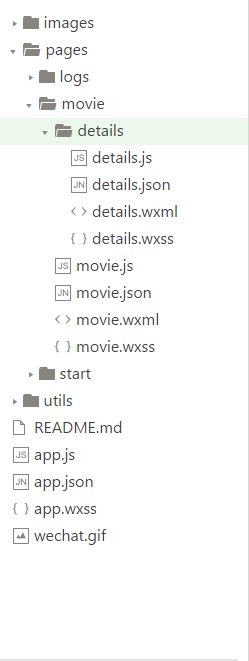
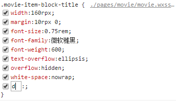
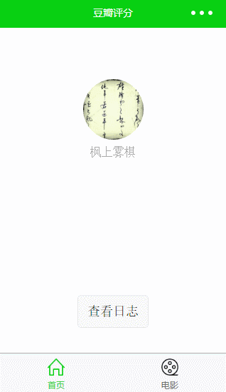

> 微信小程序自 **1** 月发布以来有段时间了，之前给我的印象就是背影很美，估计是个美女，因为听到小程序不需要下载，安装，信息触手可及，用完即走，无需卸载，感觉那可谓是前途无量，然而当时 **Ubuntu** 用的正欢，所以最近才来体验了一波。但就开发体验而言，表示实在 **有点不爽**

## 快速开始

- [简易教程](https://mp.weixin.qq.com/debug/wxadoc/dev/)
- [安装开发者工具](https://mp.weixin.qq.com/debug/wxadoc/dev/devtools/download.html)
- 添加项目(无 **AppID** 部分功能受限)
- 运行小程序
- [微信小程序应用资源汇总](https://github.com/FengShangWuQi/awesome-wechat-weapp)

## 开发槽点

### 不能使用第三方库

小程序框架由以上四种类型文件组成

- **.js**：文件负责页面逻辑，有组件开发经验，使用过 React 等主流 js 框架的同学可以轻松上手；
- **.wxml**：好比 html，通过小程序提供的组件来书写页面结构；
- **.wxss**：好比 css，书写页面的样式
- **.json**：配置文件，有 node 项目经验，配置过 **package.json** 的同学也可以轻松掌握；

但没有哪个文件支持引用第三方库，即便小程序支持 **ES6** 语法，但自 npm 和 yarn 出来后，对开发者而言，不能通过 **install** 复用代码在目前前端开发过程中可谓是是极其痛苦的，且就目前小程序提供的 UI 组件不能满足一些复杂的开发场景。

### 调试器不支持自动补全

我们在调整页面样式的时候，经常借助 **Chrome 开发者工具**，在里面修改某个元素的样式非常方便，而且可以直接预览，之后可将修改过的样式代码直接复制粘贴到文件中，大大地提高了开发者的效率，然而微信开发者工具虽也有调试器，但却并 **不支持 css 属性和样式自动补全**，相信使用 Chrome 开发者工具调试过样式的同学都会感觉特别憋屈。

##  总结

老实说，微信小程序就目前给我的开发体验不是忒好，她就像一个背影杀手，当然，小程序刚推出来不久，有些毛病那也是很正常的，如果开发者工具能够加强开发体验，我相信，在不久的将来，小程序还是能掀起一波开发热潮。

最后附上一个练手的 demo -- [wechat-douban-movie](https://github.com/FengShangWuQi/wechat-douban-movie)

