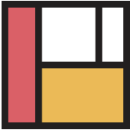
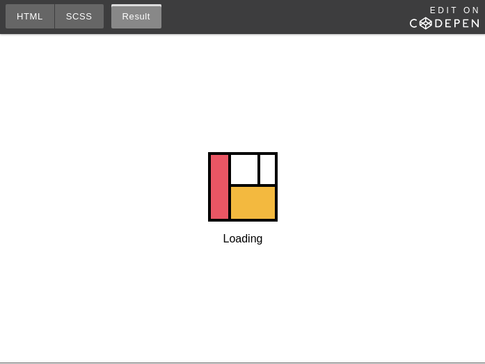
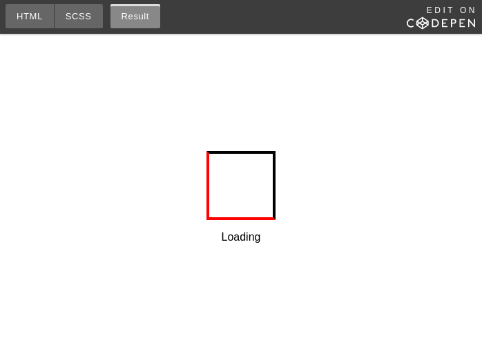

<div class="original-info">
  <div className="original-address">
    原文地址：
    <a
      href="https://codeburst.io/how-to-create-a-beautiful-animated-loader-with-nothing-but-css-d1962fc5a66c"
      target="_blank"
      rel="noopener noreferrer"
    >
      How to create a beautiful animated loader with nothing but CSS
    </a>
  </div>
  <div className="original-auth">作者：Julien Benchetrit</div>
</div>

## 为什么要做加载

只想说, 本文最重要的是对 **CSS**, **伪元素**, **keyframe** 的分享, 以及读者对这些东西的真正掌握, 我并不是怂恿大家在每一个页面的前面都去加一个酷炫的加载。

## 我是如何做的

不同的页面, 对加载的设计也就可能不同. 本文设计的加载适合大多数页面。

并且, 本文假设读者已经非常熟悉伪元素, CSS 动画属性和 keyframe, 如果读者想重温, 下面两篇文章可做参考：

- [学会使用 CSS 中的 :after 和 :before](http://t.cn/R98iMag)
- [keyframe 动画直通车](http://t.cn/R98iW8V)

### 开始入门

在开始一起构建它前, 我们先看看它最后的效果：


正如你所看到的, 我们将经历 **4** 个步骤：

- 边框一个接一个地出现；
- 红/橙/白色方块向里滑入；
- 方块向外划出；
- 边框消失；

我们只需要 **animation-direction: alternate** 来完成步骤 1 和 2, 步骤 3 和 步骤 4 我们可以使用 **reverse**, 另外, 我们可以使用 **animation-iteration-count: infinite** 重复动画。

首先, 我们先书写好基本的 HTML 结构：

```html
<!doctype html>
<html>
  <head>
    <!-- <link rel="preload"> for CSS, JS, and font files  -->
    <style type="text/css">
      /*
       *  All the CSS for the loader
       *  Minified and vendor prefixed
       */
    </style>
  </head>
  <body>
    <div class="loader">
      <!-- HTML for the loader -->
    </div>
    <header />
    <main />
    <footer />
    <!-- Tags for CSS and JS files -->
  </body>
</html>
```

### 构建 logo 本身



一开始我们先实现 logo 本身, 而不是最终版本的效果。

父级元素 logo, 不同颜色的方块都是它的子元素：

```html
<div class="logo">
  <div class="white"></div>
  <div class="orange"></div>
  <div class="red"></div>
</div>
```

我们用 less 来实现：

```less
.logo {
  position: relative;
  width: 100px;
  height: 100px;
  border: 4px solid black;
  box-sizing: border-box;
  background-color: white;

  & > div {
    position: absolute;
  }

  .red {
    top: 0;
    bottom: 0;
    left: 0;
    width: 27%;
    border-right: 4px solid black;
    background-color: #EA5664;
  }
  /* Similar code for div.orange and div.white */
}
```

logo 的效果图如下：



### 边框动画

接下来, 我们将进入棘手(**有趣**)的部分。

CSS 不允许我们直接对 div.logo 的边框进行设置达到我们想要的效果, 所以我们必须去除原有的边框, 采用其他的办法来实现。

我们要把四个边框分割开来, 然后让它们有序地出现, 所以, 我们可以使用覆盖整个 div 的两个透明的 **伪元素**。

废话少说, 就让我们开始吧, 我们先做出它最初始的样子. 我们让 **div.logo::before** 绝对位于 div.logo 的左上角，代表方块的上边框和右边框, 让 **div.logo::after** 绝对定位 div.logo 的右下角, 代表方块的下边框和左边框。

现在, less 代码如下：

```less
.logo {
  position: relative;
  width: 100px;
  height: 100px;
  box-sizing: border-box;
  background-color: white;

  &::before,
  &::after {
    content: '';
    position: absolute;
    width: 100%;
    height: 100%;
    box-sizing: border-box;
    border: 4px solid transparent;
  }

  &::before {
    top: 0;
    left: 0;
    border-top-color: black;
    border-right-color: black;
  }

  &::after {
    bottom: 0;
    right: 0;
    border-bottom-color: red; // Red for demo purposes only
    border-left-color: red;
  }
}
```

下面是 `效果`：



接下来, 我们就用 **keyframe** 做 **div.logo::before** 的第一个动画。

我们将 width 和 height 初始都为 0, 然后用 keyframe 将 width 和
height 调整到 100%。

随着我们在相应的时间把边框从透明变为黑色, 我们想要的最开始的效果就出来了。

该代码展示了伪元素的初始动画：

```less
div.logo {
  &::before,
  &::after {
    /* ... */
    animation-timing-function: linear;
  }
  &::before {
    /* ... */
    animation: border-before 1.5s infinite;
    animation-direction: alternate;
  }
}
@keyframes border-before {
  0% {
    width: 0;
    height: 0;
    border-right-color: transparent;
  }
  24.99% {
    border-right-color: transparent;
  }
  25% {
    height: 0;
    width: 100%;
    border-right-color: black;
  }
  50%,
  100% {
    width: 100%;
    height: 100%;
  }
}
```

我们对 **div.logo::after** 重复相同的操作, 不要忘了调整时间和反转 width 和 height。现在, 我们就有了最外层边框的整个动画。

### 方块动画

最后，我们一起来设置方块的动画。

我们最大的挑战是无法连接 **keyframes**。因为，我们最终想要的动画中每个小方框都有一定的顺序， 为此， 我们作如下改变：

- 0 to 25%：上边框和右边框显现；
- 25 to 50%：下边框和左边框显现；
- 50 to 65%：红色小方块显现；
- 65 to 80%：橙色小方块显现；
- 75 to 90%：白色小方块显现；

红色小方框 `keyframe` 如下：

```css
@keyframes red {
  0%,
  50% {
    width: 0;
    opacity: 0;
  }
  50.01% {
    opacity: 1;
  }
  65%,
  100% {
	width: 27%;
    opacity: 1;
  }
}
```

重复上面的代码，就可完成我们整个动画， 是不是很完美。

## 总结

感谢你的阅读，最后附上 [源码](https://codepen.io/FengShangWuQi/pen/NvjYoN)，但个人建议，不要直接阅读源码，根据上面的提示在 `codepen` 中自己来一遍才是最佳实践。