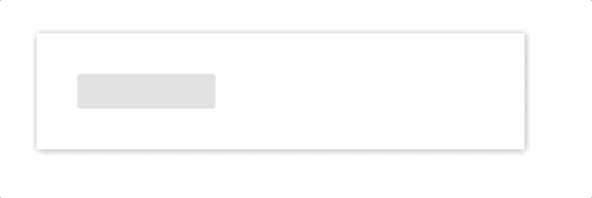
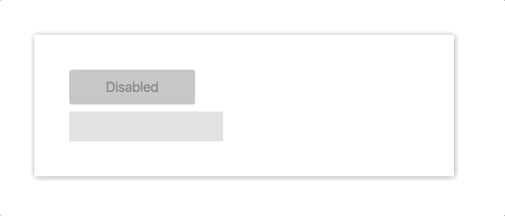
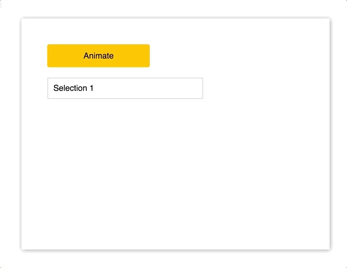
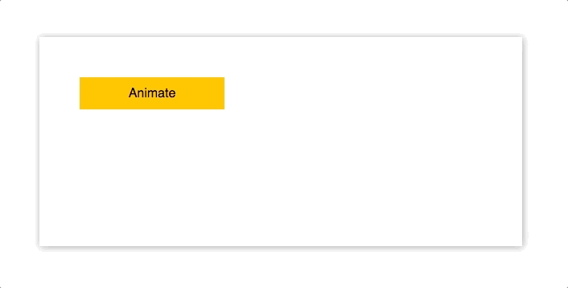
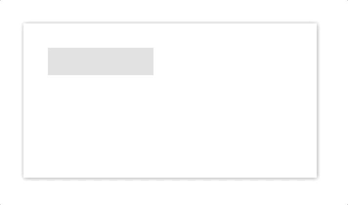

<div class="original-info">
  <div className="original-address">
    原文地址：
    <a
      href="https://medium.com/react-native-training/react-animations-in-depth-433e2b3f0e8e"
      target="_blank"
      rel="noopener noreferrer"
    >
      React Animations in Depth
    </a>
  </div>
  <div className="original-auth">作者：Nader Dabit</div>
</div>

> 在 [Tweet](http://t.cn/RQVluB2) 得到很多大佬关于 **React Web 动画** 不错的的回应，于是决定在这里分享给大家。

以下便是本文要分享的创建 **React 动画** 的几种方式：
- CSS animation
- JS Style
- [React Motion](http://t.cn/RLeuFGX)
- [Animated](http://t.cn/R9d015g)
- [Velocity React](http://t.cn/R9dOzS1)

## CSS animation

给元素添加 **class** 是最简单，最常见的书写方式，如果你的 app 正在使用 CSS，那么这将是你最愉快的选择。

赞同者：

- 我们只需修改 **opacity** 和 **transform** 这样的属性，就可构建基本的动画；
- 在组件中，我们可以非常容易地通过 **state** 去更新这些值；

反对者：

- 这种方式并 **不跨平台**，在 React Native 中就不适用；
- 对于较复杂的动画，这种方式难以控制；

接下来，我们通过一个简单的 demo 来体验一下这种创建方式：当 input focus 的时候，我们增加它的宽度。

首先，我们创建两个 input 要用到的 class：

```css
.input {
  width: 150px;
  padding: 10px;
  font-size: 20px;
  border: none;
  border-radius: 4px;
  background-color: #dddddd;
  transition: width .35s linear;
  outline: none;
}

.input-focused {
  width: 240px;
}
```

一个是它原始的样式，一个是它 focus 后的样式。

下面，我们就开始书写我们的 React 组件。



```javascript
class App extends Component {
  state = {
    focused: false,
  }

  componentDidMount() {
    this._input.addEventListener('focus', this.focus);
    this._input.addEventListener('blur', this.focus);
  }

  focus = () => {
    this.setState(prevState => ({
      focused: !prevState.focused,
    }));
  }

  render() {
    return (
      <div className="App">
        <div className="container">
          <input
            ref={input => this._input = input}
            className={['input', this.state.focused && 'input-focused'].join(' ')}
          />
        </div>
      </div>
    );
  }
}
```

- 我们有一个 focused 的 state，初始值为 false，我们通过更新该值来创建我们的动画；
- 在 componentDidMount 时，我们添加两个监听器，一个 focus，一个 blur，指定的回调函数都是 focus；
- focus 方法会获取之前 focused 的值，并负责切换该值；
- 在 render 中，我们通过 state 来改变 input 的 classNames，从而实现我们的动画；

## JS Style

JavaScipt styles 跟 CSS 中的 class 类似。

赞同者:

- 跟 CSS 动画一样，且它的表现更为清晰，且可以不必依赖 CSS；

反对者：

- 跟 CSS 动画一样，**不跨平台**，且动画一旦复杂，也难以控制；

在下面的 demo 中，我们将创建一个 input，当用户输入时，我们将一个 button 从 disable 转变为 enable。



```javascript
class App extends Component {
  state = {
    disabled: true,
  }

  onChange = (e) => {
    const length = e.target.value.length;

    if (length > 0) {
      this.setState({ disabled: false });
    } else {
      this.setState({ disabled: true });
    }
  }
  render() {
    const { disabled } = this.state;
    const label = disabled ? 'Disabled' : 'Submit';

    return (
      <div style={styles.App}>
        <input
          style={styles.input}
          onChange={this.onChange}
        />
        <button
          style={Object.assign({},
            styles.button,
            !this.state.disabled && styles.buttonEnabled
          )}
          disabled={disabled}
        >
          {label}
        </button>
      </div>
    );
  }
}


const styles = {
  App: {
    display: 'flex',
    justifyContent: 'left',
  },
  input: {
    marginRight: 10,
    padding: 10,
    width: 190,
    fontSize: 20,
    border: 'none',
    backgroundColor: '#ddd',
    outline: 'none',
  },
  button: {
    width: 90,
    height: 43,
    fontSize: 17,
    border: 'none',
    borderRadius: 4,
    transition: '.25s all',
    cursor: 'pointer',
  },
  buttonEnabled: {
    width: 120,
    backgroundColor: '#ffc107',
  }
}
```

- 我们有一个 disabled 的 state，初始值为 true；
- onChange 方法会获取用户的输入，当输入非空时，就切换 disabled 的值；
- 根据 disabled 的值，确定是否将 buttonEnabled 添加到 button 中；

## React Motion

React Motion 是 [Cheng Lou](https://medium.com/@chenglou) 书写的一个非常不错的开源项目。它的思想是可以对 **Motion** 组件进行简单的样式设置，然后你就可以在回调函数中通过这些值，享受动画带来的乐趣。

对于绝大多数的动画组件，我们往往不希望对动画属性（宽高、颜色等）的变化时间做硬编码处理，**react-motion** 提供的 **spring** 函数就是用来解决这一需求的，它可以逼真地模仿真实的物理效果，也就是我们常见的各类 **缓动效果**。

下面是一个简单的 demo：

```javascript
<Motion style={{ x: spring(this.state.x) }}>
  {
    ({ x }) =>
      <div style={{ transform: `translateX(${x}px)` }} />
  }
</Motion>
```

这是官方提供的几个 demo，可谓是不看不知道，一看吓一跳。

- [Chat Heads](http://t.cn/R9epBQV)
- [Draggable Balls](http://t.cn/R9eprR8)
- [TodoMVC List Transition](http://t.cn/R9epdOH)
- [Water Ripples](http://t.cn/R9epgoj)
- [Draggable List](http://t.cn/R9epe9u)

赞同者：
- React Motion 可以在 React Web 中使用，也可以在 React Native 中使用，因为它 **跨平台**；
- 其中的 **spring** 概念最开始对我来说很陌生，然而上手之后，发现它真的很神奇，并且，它有很详细的 API；

反对者：
- 在某些情况下，他不如纯 CSS / JS 动画；
- 虽然它有不错的 API，容易上手，但也需要学习成本；

首先使用 yarn 或 npm 安装：
```bash
$ yarn add react-motion
```

在下面的 demo 中，我们将创建一个 dropdown 菜单，当点击按钮时，下拉菜单友好展开。



```javascript
import { Motion, spring } from 'react-motion';

class App extends Component {
  state = {
    height: 38,
  }

  animate = () => {
    this.setState((state) => ({ height: state.height === 233 ? 38 : 233 }));
  }

  render() {
    return (
      <div className="App">
        <div style={styles.button} onClick={this.animate}>Animate</div>
        <Motion
          style={{ height: spring(this.state.height) }}
        >
          {
            ({ height }) =>
            <div style={Object.assign({}, styles.menu, { height } )}>
              <p style={styles.selection}>Selection 1</p>
              <p style={styles.selection}>Selection 2</p>
              <p style={styles.selection}>Selection 3</p>
              <p style={styles.selection}>Selection 4</p>
              <p style={styles.selection}>Selection 5</p>
              <p style={styles.selection}>Selection 6</p>
            </div>
          }
        </Motion>
      </div>
    );
  }
}

const styles = {
  menu: {
    marginTop: 20,
    width: 300,
    border: '2px solid #ddd',
    overflow: 'hidden',
  },
  button: {
    display: 'flex',
    width: 200,
    height: 45,
    justifyContent: 'center',
    alignItems: 'center',
    border: 'none',
    borderRadius: 4,
    backgroundColor: '#ffc107',
    cursor: 'pointer',
  },
  selection: {
    margin: 0,
    padding: 10,
    borderBottom: '1px solid #ededed',
  },
}
```

- 我们从 react-motion 中 import **Motion** 和 **spring**；
- 我们有一个 height 的 state，初始值为 38，代表 menu 的高度；
- animate 方法设置 menu 的 height，切换 height 的值；
- 在 render 中，我们使用 Motion 组件包装整个 p 标签列表，将 state.height 的当前值设为组件的 height，然后在组件的回调函数中使用该值作为整个下拉的高度；
- 当按钮被点击时，我们通过 this.animate 切换下拉的高度；

## Animated

Animated 是基于 React Native 使用的同一个动画库建立起来的。

它背后的思想是创建 **声明式动画**，通过传递配置对象来控制动画。

赞同者：
- **跨平台**，它在 React Native 中已经非常稳定，如果你在 React Native 中使用过，那么你将不用再重复学习；
- 其中的 **interpolate** 是一个神奇的插值函数，我们将在下面看到；

反对者：
- 目前不是 100% 的稳定，在老的浏览器中的，存在前缀和性能的问题；

首先使用 yarn 或 npm 安装：
```
$ yarn add animated
```

在下面的 demo 中，我们将模拟在提交表单成功后显示的动画 message。



```javascript
import Animated from 'animated/lib/targets/react-dom';
import Easing from 'animated/lib/Easing';

class AnimatedApp extends Component {
  animatedValue = new Animated.Value(0);

  animate = () => {
    this.animatedValue.setValue(0);

    Animated.timing(
      this.animatedValue,
      {
        toValue: 1,
        duration: 1000,
        easing: Easing.elastic(1),
      }
    ).start();
  }

  render() {
    const marginLeft = this.animatedValue.interpolate({
      inputRange: [0, 1],
      outputRange: [-120, 0],
    });

    return (
      <div className="App">
          <div style={styles.button} onClick={this.animate}>Animate</div>
          <Animated.div
            style={
              Object.assign(
                {},
                styles.box,
                { opacity: this.animatedValue, marginLeft })}
          >
            <p>Thanks for your submission!</p>
          </Animated.div>
      </div>
    );
  }
}

const styles = {
  button: {
    display: 'flex',
    width: 125,
    height: 50,
    justifyContent: 'center',
    alignItems: 'center',
    border: 'none',
    borderRadius: 4,
    backgroundColor: '#ffc107',
    cursor: 'pointer',
  },
  box: {
    display: 'inline-block',
    marginTop: 10,
    padding: '0.6rem 2rem',
    fontSize:'0.8rem',
    border: '1px #eee solid',
    borderRadius: 4,
    boxShadow: '0 2px 8px rgba(0,0,0,.2)',
  },
}
```

- 从 animated 中 import **Animated** 和 **Easing**；
- 用 **new Animated.Value(0)** 创建一个值为 0 的类属性 - animatedValue；
- 创建 animate 方法，处理所有的动画，首先通过 **this.animatedValue.setValue(0)** 初始化动画值，实现的效果就是每次重新执行该动画，然后调用 **Animated.timing**，**animatedValue** 作为第一个参数传递，配置对象作为第二个参数，一个设置最终动画值，一个设置持续时间，一个设置 **缓动效果**。
- 在 render 中，我们用 **interpolate** 方法创建 marginLeft 对象，包含 **inputRange** 和 **outputRange** 数组，我们使用此对象作为 UI 中 message 的 style 属性；
- 我们使用 **Animated.div** 替代默认的 div；
- 我们将 animatedValue 和 marginLeft 作为 Animated.div 的 style 属性；

## Velocity React

Velocity React 是基于已经存在的 **Velocity** 建立起来的。

赞同者：

- 上手容易，API 简单明了，相对其他库更易于掌握；

反对者：

- 有些不得不克服的问题，比如 componentDidMount 后动画并没有真正地起作用等；
- 不跨平台；

下面是一个简单的 demo：

```javascript
<VelocityComponent
  animation={{ opacity: this.state.showSubComponent ? 1 : 0 }}      
  duration={500}
>
  <MySubComponent/>
</VelocityComponent>
```

首先还是先用 yarn 或 npm 安装：

```bash
$ yarn add velocity-react
```

在下面的 demo 中，我们将创建一个很酷的动画输入。



```javascript
import { VelocityComponent } from 'velocity-react';

const VelocityLetter = ({ letter }) => (
  <VelocityComponent
    runOnMount
    animation={{ opacity: 1, marginTop: 0 }}
    duration={500}
  >
    <p style={styles.letter}>{letter}</p>
  </VelocityComponent>
)

class VelocityApp extends Component {
  state = {
    letters: [],
  }

  onChange = (e) => {
    const letters = e.target.value.split('');
    const arr = [];

    letters.forEach((l, i) => {
      arr.push(<VelocityLetter letter={l} />)
    });
    this.setState({ letters: arr });
  }

  render() {
    return (
      <div className="App">
        <div className="container">
          <input onChange={this.onChange} style={styles.input} />
          <div style={styles.letters}>
            {
              this.state.letters
            }
          </div>
        </div>
      </div>
    );
  }
}

const styles = {
  input: {
    marginBottom: 20,
    padding: 8,
    width: 200,
    height: 40,
    fontSize: 22,
    backgroundColor: '#ddd',
    border: 'none',
    outline: 'none',
  },
  letters: {
    display: 'flex',
    height: 140,
  },
  letter: {
    marginTop: 100,
    fontSize: 22,
    whiteSpace: 'pre',
    opacity: 0,
  }
}
```
- 从 velocity-react 中 import **VelocityComponent**；
- 我们要创建一个可重复使用的组件来满足每个 letter 的动画；
- 在这个组件中，我们将 animation 的 opacity 设为 1，marginTop 设为 0，这些值代表着传入子组件的重写值，即当组件被创建时，组件的 opacity 会由初始的 0 变为 1，marginTop 会由初始的 100 变为 0，我们还设置了 500 ms 的持续时间，最后值得一提的是 **runOnMount** 属性，它的意思是在组件挂载或创建完后执行该动画；
- 其中的 onChange 方法会获取用户的每次输入，并创建一个由 **VelocityLetter** 组成的新数组；
- 在 render 中，我们就使用该数组在 UI 中渲染 letters；

## 总结

总的来说，基本的动画，我会选择 JS style，复杂的动画，我更偏向 React Motion，而对于 React Native，我还是坚持使用 Animated，一旦 Animated 成熟，在 Web 中可能也会投入使用，目前，我很享受 React Motion。