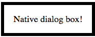
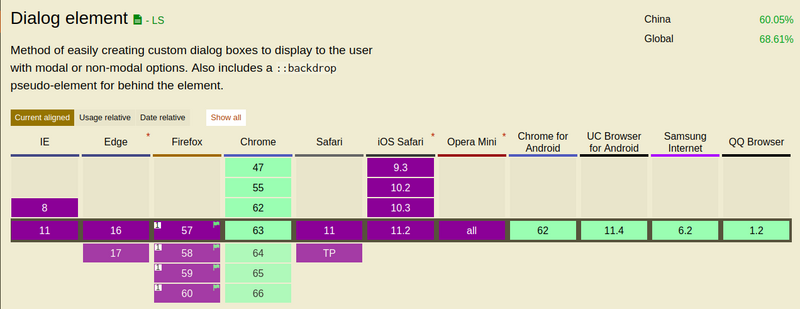

<div class="original-info">
  <div className="original-address">
    原文地址：
    <a
      href="https://keithjgrant.com/posts/2018/meet-the-new-dialog-element"
      target="_blank"
      rel="noopener noreferrer"
    >
      Meet the New Dialog Element
    </a>
  </div>
  <div className="original-auth">作者：Keith</div>
</div>

> 不到一个月前，**HTML 5.2** 正式成为 **W3C** 的推荐标准（**REC**）,其中，推出了一个新的原生模态对话框元素 **dialog**，乍一看，可能感觉它就是一个新增的元素，然而，作者最近在玩的时候，发现它确实是一个值得期待和很有意思的元素，在这里分享给大家。

这是 **diglog** 最基础的示例：

```html
<dialog open>
	Native dialog box!
</dialog>
```

其中，**open** 属性表示此时 dialog 是可见的，如果没有 open，dialog 将会隐藏，你可以使用 JavaScipt 将它显现出来，此时，dialog 渲染如下：



它绝对定位于页面之上，就如我们期望的一样，出现在内容的上方，并且水平居中，默认情况下，它和内容一样宽。

## 基本操作

JavaScipt 有几个方法和属性可以很方便地处理 dialog 元素，使用最多的可能还是 **showModal()** 和 **close()**：

 ```javascript
const modal = document.querySelector('dialog');

// makes modal appear (adds `open` attribute)
modal.showModal();

// hides modal (removes `open` attribute)
modal.close();
 ```

当你使用 showModal() 来打开 dialog 时，将会在 dialog 周围加一层阴影，阻止用户与非 diglog 元素的交互，默认情况下，阴影是完全透明的，你可以使用 CSS 来修改它。

按 **Esc** 可以关闭 dialog，你也可以提供一个按钮来触发 **close()**。

还有一个方法是 **show()**，它也可以让 dialog 显现，但与 showModal() 不同的是它没有阴影，用户可以与非 dialog 元素进行交互。

## 浏览器支持和 Polyfill

目前，只有 **chrome** 支持 dialog，**Firefox** 需要在 **about:config** 里允许 **dom.dialog_element.enabled** 才能正常使用，我猜想，Firefox 在不久的将来就会支持。



上图为 [caniuse.com](http://caniuse.com/#search=dialog) 关于 dialog 特性主流浏览器的兼容情况。

幸运的是，我们可以使用 [dialog-polyfill](https://caniuse.com/#search=dialog) 来缓解这种尴尬，它既提供了 JavaScript 的行为，也包含了默认的样式，我们可以使用 npm 来安装它，也可以使用 script 标签来引用它。目前，它已支持各主流浏览器，包括 IE 9 及其以上版本。

只是，在使用它时，每个 dialog 需要使用下面语句进行初始化：

```javascript
dialogPolyfill.registerDialog(dialog);
```

并且，它并不会取代浏览器原生的行为。

## 样式
打开和关闭模态框是最基本的，但这是肯定不够的，dialog 最开始时样式是不怎么好看的，因此，我们需要自定义它的样式，此外，我们可以通过设置伪元素 **::backdrop** 来优化 dialog 显现时背影的样式。

```css
dialog {
	padding: 0;
	width: 478px;
	text-align: center;
	vertical-align: middle;
	border-radius: 5px;
	border: 0;
}

dialog::backdrop {
	background-color: rgba(0, 0, 0, 0.1);
}
```

为了兼容老的浏览器，使用 polyfill 时，::backdrop 是不起作用的，但 polyfill 会在 dialog 后面添加一个 **.backdrop** 元素，我们可以像下面这样定位它：

```css
dialog + .backdrop {
  background-color: rgba(0, 0, 0, 0.4);
}
```

接下来，是时候向 dialog 里添加更多的内容，一般包括 header， body 和 footer。

```html
<dialog id="sweet-modal">
    <h3 class="modal-header">sweet dialog</h3>
	<div class="modal-body">
	    <p>This is a sweet dialog, which is much better.</p>
	</div>
	<footer class="modal-footer">
	    <button id="get-it" type="button">Get</button>
	</footer>
</dialog>
```

最后，在添加一些 CSS，你就能得到你想要的。

## 进阶操作
通常，我们期望能从 dialog 中获取一些用户的信息。关闭 dialog 时，我们可以给 close() 传递一个 string，然后通过 dialog 元素的 **returnValue** 属性来获取。

```javascript
modal.close('Accepted');

console.log(modal.returnValue); // logs `Accepted`
```

当然，还存在额外的事件我们可以监听，其中，最常用的可能是 close（关闭 dialog 时触发），还有 cancel （用户按 Esc 关闭 dialog 时触发） 。

此外，我们可能还期望点击 dialog 旁边的阴影来关闭，当然，这也是有解决办法的，点击阴影会触发 dialog 的点击事件，如果 dialog 的子元素占满了整个 dialog，那么我们可以通过监听 dialog 的点击，当 target 为 modal 时来关闭。

```javascript
modal.addEventListener('click', (event) => {
	if (event.target === modal) {
		modal.close('cancelled');
	}
});
```

当然，这不是完美的，但它确实有效，如果你有更好的方式，欢迎在评论中交流。

## 总结
说了这么多，不如自己实际演练一番，作者也做了一个 [demo](https://codepen.io/FengShangWuQi/pen/qpMgZB)，欢迎参考。

