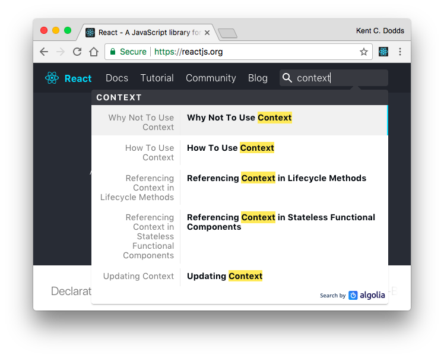
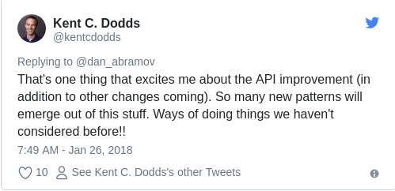

<div class="original-info">
  <div className="original-address">
    原文地址：
    <a
      href="https://blog.kentcdodds.com/reacts-%EF%B8%8F-new-context-api-70c9fe01596b"
      target="_blank"
      rel="noopener noreferrer"
    >
      React's ⚛️ new Context API
    </a>
  </div>
  <div className="original-auth">作者：kentcdodds</div>
</div>

这不再是一个 **实验性的 API**，并且它更符合工程化的理念，目前它已成为 **React 一级棒的 API**。

> ⚠️ ：大家可以通过 [newsletter](https://tinyletter.com/kentcdodds) 获取我最新的资讯，我一般每两周通过邮件发送一次，大家可以通过自己的收件箱获取更多的内容。

React 中的 **context API** 相信大家都知道吧，可能跟大伙一样，当看到 React 的官方文档是这样时，都不敢直接使用它。



第一条搜索结果显示的就是 [为什么不建议使用 context](https://reactjs.org/docs/context.html#why-not-to-use-context)，让大家瞬间产生忧虑，该章节是这么描述 context 的：

> 如果你想让你的应用更加稳定，就别使用 **context**，因为这是一个实验性的 API，在未来的 React 版本中可能会发生改变。

⚠️ 注意，这里的改变包含中断，终止，不再使用。

## 那么，为什么还要使用 context 呢

你曾经历过尝试在一个层级很深的组件中获取最外层组件的 state 的痛苦么，这种痛苦叫 **prop drilling**，可谓让人接近崩溃的。当遇到这种情形时，你肯定不会喜欢用 props 来传递数据，因为如果中间有个组件发生改变，这个代价将是几何 :joy:。

实际上，你可以通过使用常规的 **JavaScript module** 来规避以上的问题，将数据存在某个 module 中，就可以实现在任何地方访问和导入了，但这么做会让更新变得困难（你必须实现一个 event 在数据更新时触发，通知用户数据发生改变），并且，服务端渲染对 module 也会有 [影响](https://stackoverflow.com/questions/40935571/why-singleton-store-in-flux-can-cause-issue-for-server-side-rendering/40974748#40974748)。

因此，像 [redux](https://redux.js.org/) 这样的负责 **状态管理** 的第三方库进入了大家的视野。它允许你在任何地方从 **store** 获取数据，你需要做的只是使用 **Provider** 包装一下，然后就可以神奇地在 **connected** 的组件中轻松地获取想要的数据了。

然而，如果我告诉你 **Provider** 就是在使用 context 这个实验性 API 呢？😱 事实确实是这样的！provider 组件将数据存进 context 中，connect 高阶组件从 context 获取数据，所以，redux 事实并不允许你的数据在任何地方访问。

那么，为什么还要使用 context 呢？可能是大家已经深深地爱上它了吧！即使你没有直接使用 context，你的应用程序也会通过引用像 [react-redux](https://github.com/reactjs/react-redux/blob/76dd7faa90981dd2f9efa76f3e2f26ecf2c12cf7/src/components/connectAdvanced.js#L136-L143)， [MobX-react](https://github.com/mobxjs/mobx-react/blob/dc249910c74c1b2e988a879be07f10aeaea90936/src/Provider.js#L19-L34)， [react-router](https://github.com/ReactTraining/react-router/blob/e6f9017c947b3ae49affa24cc320d0a86f765b55/packages/react-router/modules/Router.js#L23-L34)， [glamorous](https://github.com/paypal/glamorous/blob/7468bfc76f46783cac841e20973ed119c771f3b7/src/theme-provider.js#L33-L37) 这样的第三方库间接用到它。

## Context 重生啦

现在清楚了，我们是如此地热爱 context，但官方文档的警告依然还在：在 React 的未来版本中，可能不再使用它，好消息是，**context** 要正式跟大家打招呼了，而且大家可能会比之前更爱它。

一个月前，React 团队 从 [yarn](https://github.com/yarnpkg/rfcs)，[rust](https://github.com/rust-lang/rfcs) 和 [Ember](https://github.com/emberjs/rfcs) 的 **rfcs 仓库** 受到启发，建立了一个自己的 [rfcs](https://github.com/reactjs/rfcs) 仓库。仓库第一个 PR 来自 [Andrew Clark](https://twitter.com/acdlite)（React 团队核心成员），PR 标题为 [New version of context](https://github.com/reactjs/rfcs/pull/2)，其中 **Andrew Clark** 概述了未来新版本的 context 是怎样的，之后还存在一些有趣的讨论，几天后，Andrew Clark 就向 React 仓库提了一个 [New context API](https://github.com/facebook/react/pull/11818) 的 PR。

那么，到底有什么改变呢？据肉眼估计，新的 API 与之前的 API 存在百万级别的差异，下面是一个简单的 [示例](https://codesandbox.io/s/n4r0qq898j?from-embed)：

```javascript
const ThemeContext = React.createContext('light')
class ThemeProvider extends React.Component {
  state = {theme: 'light'}
  render() {
    return ThemeContext.provide(this.state.theme, this.props.children)
  }
}

const ThemeConsumer = ({children}) => ThemeContext.consume(children)

class App extends React.Component {
  render() {
    <ThemeProvider>
      <ThemeConsumer>{val => <div>{val}</div>}</ThemeConsumer>
    </ThemeProvider>
  }
}
```

> 你可能注意到示例中使用到一个 **render prop**，但实际上并没有任何关于需要使用 render prop 的 context API，你可以使用 context API 轻松实现高阶组件或其他功能。

新的 **context API** 主要由以下三部分组成：

- **React.createContext**：用于传递初始值（可选择 [使用 bitmask 的一个奇妙的选择性退出函数](https://twitter.com/acdlite/status/957446433656864768)），返回一个包含 provider 和 consumer 的对象；
- **provide**：使用 higher，并可以接收任何值；
- **consume**：在 provider 之后任何地方使用，并传递一个返回 JSX 的函数（这有点像 render prop 组件，但 consume 不是组件）；

我对这个 API 充满了期待，React 团队也将会移除 **context 是实验性 API** 的警告，因为它现在是框架 [一级棒的特性](https://twitter.com/acdlite/status/957445801302618112)，这也意味着大家将不再那么担心使用 context 来解决应用中 prop-drilling 的问题了，对 Redux 不再那么依赖，对 React 也将更加喜欢。

[我最近在 twitter 看到的](https://twitter.com/kentcdodds/status/911276059051438082)，大概意思是：

> 大家不是很愿意保持使用提倡的 render 方法，加重了 prop drilling 问题，所以，最终想通过 redux 来缓解。

所以，我认为如果我们不过早或武断地去破坏 render 方法，我们可能就不会那么痛苦，即便最终我们实在没有办法避免，我们也可以通过核心的 React API 来解决。

## Context 实践

我看到了一个关于 context API（或普通的 render prop pattern）的问题很多次，就是如何组合 providers 和 consumers，当在一个 render 方法中把一堆 render prop 组件放在一起时，就会像这样 [嵌套](https://twitter.com/acdlite/status/955955121979969537)。


那么，我们可以做点什么来避免呢？其实，个人觉得没有那么糟糕，如果你觉得这样并不好，那么可以使用常规的 **utility** 函数/组件来解决，下面是一个示例：

```javascript
const ThemeContext = React.createContext('light')
class ThemeProvider extends React.Component {/* code */}
const ThemeConsumer = ({children}) => ThemeContext.consume(children)
const LanguageContext = React.createContext('en')
class LanguageProvider extends React.Component {/* code */}
const LanguageConsumer = ({children}) => LanguageContext.consume(children)

function AppProviders({children}) {
  return (
    <LanguageProvider>
      <ThemeProvider>
        {children}
      </ThemeProvider>
    </LanguageProvider>
  )
}

function ThemeAndLanguageConsumer({children}) {
  return (
    <LanguageConsumer>
      {language => (
        <ThemeConsumer>
          {theme => children({language, theme})}
        </ThemeConsumer>
      )}
    </LanguageConsumer>
  )
}

class App extends React.Component {
  render() {
    <AppProviders>
      <ThemeAndLanguageConsumer>
        {({theme, language}) => <div>{theme} and {language}</div>}
      </ThemeAndLanguageConsumer>
    </AppProviders>
  }
}
```

目标是使用常见的案例，结合特殊功能的函数/组件，使案例更加工程化。

除此之外，大家还可以参考 [jmeas](https://medium.com/@jmeas) 的 [react-composer](https://codesandbox.io/s/92pj14134y?from-embed)。

在这里需要提及的是，在实践中，并不建议大家嵌套渲染 props components，无论什么时候，都可以选择创建多个简单易用的组件，然后组合使用。

## 总结

正如上面所说的，我对这个 API 充满了期待。目前暂未发布，但应该会包含在下一个 **minor** 版本中。不同担心，之前的 API 会继续正常工作，直到下一个 major 版本发布，所以，每个人都有时间迁移，而且不用过于担心，React 团队在 Facebook 有超过 **50,000** 个 React components 需要维护，所以，将来很有可能会发布一个 **codemod** 去自动更新大多数人的代码（就像以往一样）。

最后再表达一下我对此的兴奋。

